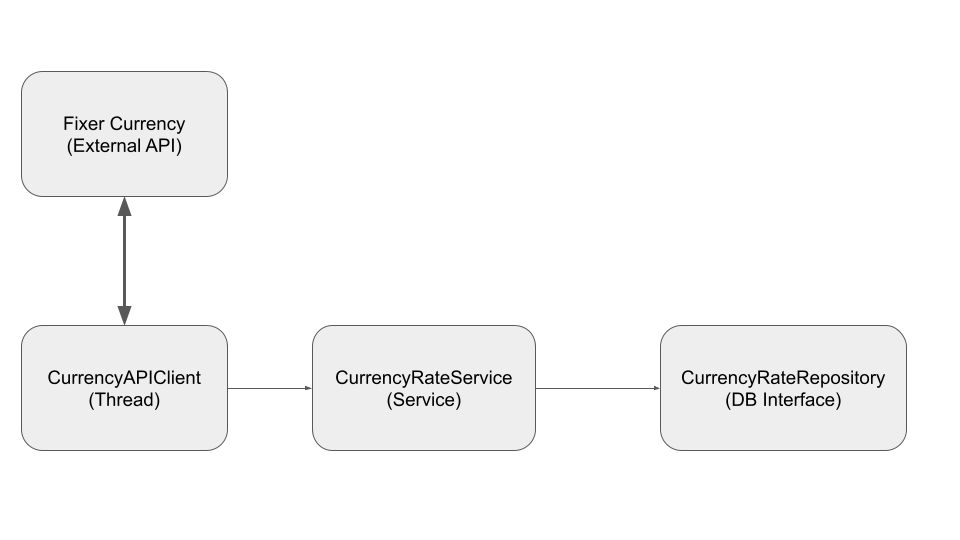
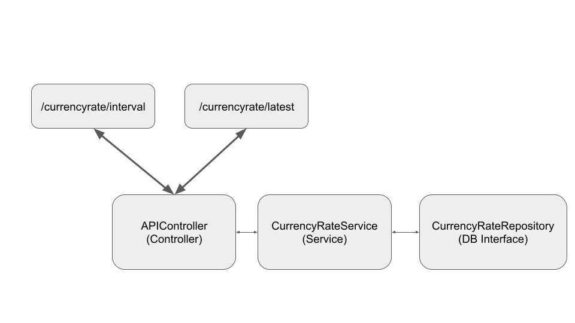

# Projeto Neurotech

Esse repositório contém a solução para o problema proposto como atividade da Seleção para vaga na Neurotech implementada utilizanado a linguagem Java e o framework SpringBoot.

## Descrição do problema

A solução deve ser uma API com dois Endpoints, sendo um deles para fornecer a taxa de conversão entre Real e Dólar (BRL-USD) mais recente e outro endpoint para fornecer as taxas dentro de um intervalo de datas. Além disso, a solução deve implementar um cliente que faz requisições à uma API externa para obter essas taxas com o período de atualização configuravel e armazená-las em um banco de dados.

## Tecnologias usadas

- **Springboot**: Toda a arquitetura da solução foi desenvolvida usando esse framework que permite a criação mais rápida de projetos em Java e permite uma fácil gestão de depedências e da comunicação com o Banco de Dados. Além disso, o framework já conta com uma implementação de servidor TOMCAT que permite testes durante o desenvolvimento e a criação direta de uma aplicação standalone.

- **MySQL**: O MySQL foi utilizado para garantir a persintência dos dados obtidos da API Externa indicada. Para facilitar o desenvolvimento, foi utilizada uma imagem Docker e o Container foi criado usando o Docker-Compose, criando uma estrutura de Micro-Serviços.

- **Docker-Compose**: Para evitar a necessidade de instalação de todo ambiente do MySQL e aproveitar o máximo possivel de uma arquitetura de Micro-Serviços, foi utilizado o orquestrador de containers Docker-Compose. Este orquestrador permite configurar e lançar diversos micro-serviços a partir de um único comando que executa um arquivo de configurações.

- **Fixer currency API**: Para obter os dados de Taxa de Conversão, foi utilizada a API indicada. Entretanto, por não ser uma API pública e conter chaves de acesso, foi necessário modificar elementos na solução para que esta aceitasse a configuração de variáveis de ambiente. Abaixo será mostrado o processo para configurar tais variáveis na IDE IntelliJ IDEA da Jetbrains.

- **IntelliJ IDEA**: Devido a vasta documentação e a sua popularidade, a IDE escolhida para a construção deste projeto foi a IntelliJ IDEA da Jetbrains em sua versão community. Assim, recomendo que o projeto seja executado com ela também.

## Arquitetura

É possivel separar a arquitetura deste projeto em dois principais componentes: O primeiro componente é o cliente que consulta a API externa e salva os dados no banco de dados. As requsições para a API externa foram feitas com métodos do protocolo HTTP.

Abaixo é possivel ver um esquemático do funcionamento deste cliente, que por sua vez roda em uma thread especifica. Esta thread, ao ser inicializada, verifica, através do serviço criado para gerenciar o banco de dados, se o banco está vazio. Caso esteja, esse banco é populado com informações de uma janela de tempo determinada e configuravel no arquivo [CurrencyAPIClientConfigs.java](./src/main/java/pedro/neurotech/neurotechapi/CurrencyAPIClient/CurrencyAPIClientConfigs.java) através do atributo `daysBeforeToInitDB`. Após a rotina de inicialização, essa thread é executada com uma frenquência determinada no mesmo arquivo, através do atributo `frequencyToUpdateDB`, tendo como unidade básica a quantidade de "Dias".



O segundo componente é a API para consultar o valor mais recente da taxa de conversão ou obter os vários resultados dentro de um intervalo de datas. Para isso, foram implementados os seguintes Endpoints:

- `/currencyrate/latest`
    - Este endpoint é responsável por entregar a taxa de conversão entre BRL e USD mais recente obtida da Fixer Currency API. 

- `/currencyrate/interval` ou `/currencyrate/interval?startDate=yyyy/mm/dd&endDate=yyyy/mm/dd`

    - Na primeira forma, este endpoint é responsável por entregar as taxas de conversão entre BRL e USD entre duas datas padrões definidas em código, sendo elas 15/08/1996 e 15/08/2022 caso elas existam no banco. Essa entrega será feita na forma de uma lista de objetos JSON. Caso contrário será entregue uma lista vazia.

    - Na segunda forma, este endpoint é responsável por entregar as taxas de conversão entre BRL e USD entre as duas datas informadas caso elas existam no banco. Essa entrega será feita na forma de uma lista de objetos JSON. Caso contrário será entregue uma lista vazia.




### Formato do JSON

```JSON
{
    "id":591,
    "base":"BRL",
    "date":"2022-08-13",
    "rates":{"USD":0.19699}
}
```

### Database

Como foi falado anteriormente, este projeto utilizou o MySQL para a persistência dos dados. O lançamento do serviço foi feito com Docker-Compose e as configurações usadas para o lançamento estão no [docker-compose.yml](./docker-compose.yml).

O schema para o Banco de Dados foi criado com base nos atributos desritos para a Classe [CurrencyRate](.//src/main/java/pedro/neurotech/neurotechapi/model/CurrencyRate.java).

Já a conexão da aplicação com o banco de dados foi feita utilizando o próprio Spring Boot e os parametros desta conexão estão descrito no [application.yml](./src/main/resources/application.yml).

## Testes

Pensando em testes unitários, foram implementados testes para a interface do repositório e para o serviço que contém as regras de negócios. Casos de "caminho feliz" e possiveis exceções foram implementados apenas para garantir que as interfaces estão funcionando de acordo com o que é esperado.

## Rodar o Projeto

Caso você não tenha instalado no seu computador o Docker-Compose, sugiro seguir este [vídeo](https://www.youtube.com/watch?v=ZPUC3wZgDoA&list=PL62G310vn6nFBIxp6ZwGnm8xMcGE3VA5H&index=13) para instalá-lo e em seguida executar etapas abaixo para executar o projeto.

1- Para rodar o projeto, você precisa levantar o serviço do MySQL. Então siga os passos abaixo:

```
cd neurotech-api
docker-compose up
```

2- Em seguida, configure as Variaveis de Ambiente `RAPIDAPIKEY` e `RAPIDAPIHOST`. Se você estiver usando o IntelliJ IDEA, abra o menu `run->Edit Configurations...->Environment Variables` e preencha o campo da seguinte forma:

```
RAPIDAPIKEY=XXXXXXXXXXXXXXXXXXXXXXXXXXX;RAPIDAPIHOST=XXXXXXXXXXXXXXXXXXX
```

**Importante 1:** para o IntelliJ, use `;` como separador.  
**Importante 2:** O valor das chaves foi enviado via email junto com a entrega do projeto.

Tendo feito todas as configurações, você pode rodar a solução normalmente.


## Features a Serem Implementadas

1- Usar uma API Aberta para consulta das taxas.

2- Implementação de testes para cobrir o controlador e a API externa.

3- Implementação de CI/CD para gerar um fluxo de teste a cada commit/push de mundanças.

4- Extender o conceito de micro-serviços e Docker usando com o DB para a própria aplicação.

5- Modificar a implementação da thread que consome a API externa para o caso do intervalo de atualização ser maior que 1 dia e ela requisitar todos os dias desde a ultima consulta feita.

## Referências

- [Spring Boot 2 Essentials](https://www.youtube.com/watch?v=bCzsSXE4Jzg&list=PL62G310vn6nFBIxp6ZwGnm8xMcGE3VA5H&index=1)

- [IntelliJ IDEA Community](https://www.jetbrains.com/pt-br/idea/download/#section=windows)

- [Gerador de projetos Spring Boot](https://start.spring.io)

- [Docker Desktop Windows](https://docs.docker.com/desktop/install/windows-install/)

- [Docker Compose](https://docs.docker.com/compose/)
